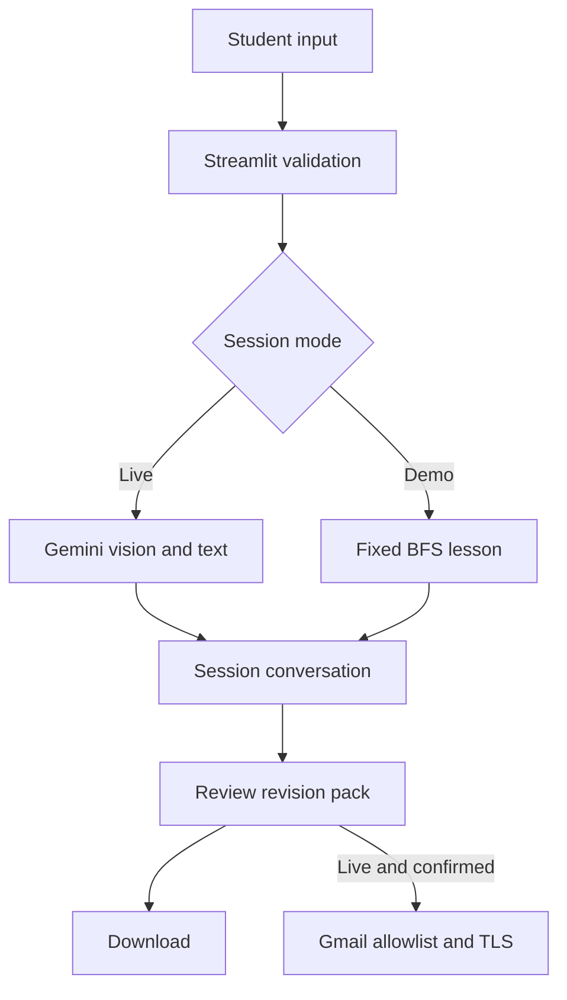

# Snap & Study: research and implementation plan

Research date: 4 October 2026. This is technical desk research and a reasoned project choice, not a user study or an empirical evaluation of learning outcomes.

## 1. Project selection

The supplied guide offers Snap & Study, Receipt & Expense Tracker / Bill Splitter, and Deadline Tracker. It asks for Gemini vision + chat followed by an external messaging action. We chose **Snap & Study**, using **email** as the action tool offered in the guide.

| Candidate | Useful result | Main correctness challenge | Decision |
|---|---|---|---|
| Snap & Study | Understand a page, then keep a revision pack | Misread handwriting or incorrect explanations | Selected: fits a BTech student's workflow and allows visible, checkable steps |
| Receipt / bill splitter | Extract and divide a bill | Decimal arithmetic, tax, discounts and reconciliation | Good alternative, but needs deterministic financial calculations |
| Deadline tracker | Extract due dates and send a digest | Ambiguous dates, missing years and timezones | Defer: dates need a review step and true scheduled reminders need a scheduler |

These are design judgements, not measured market rankings. The selected MVP can show the complete workshop flow without training a model, integrating a database, or setting up WhatsApp templates.

## 2. Problem, target user and outcome

**Problem hypothesis:** students often have a photo or screenshot of material they cannot explain confidently. Repeatedly switching between that image, search results and scattered notes adds friction.

**Target user:** an undergraduate revising lecture notes, data structures, mathematics, engineering diagrams or code. Initial demonstration: breadth-first search, familiar in BTech coursework.

**Outcome:** upload one clear problem, understand its key idea, ask follow-ups, then keep an editable revision pack. Hints and practice are product choices intended to support learning; no improvement in grades is claimed.

## 3. Research findings and decisions

| Finding from official references | Implementation decision | Source |
|---|---|---|
| Gemini supports multimodal image understanding and inline image data; inline requests have a total size constraint. | Send validated, resized JPEG bytes with text; cap image count and session size. No separate OCR model. | [1] |
| The Python SDK provides typed content parts and content generation. | Use `google-genai`, typed user/model turns and a cached client. Keep each user's history in their session. | [2] |
| Streamlit chat input supports file attachments alongside text. | One chat composer accepts JPG/PNG and an optional caption. | [3] |
| App Passwords require 2-Step Verification and may be unavailable for some accounts. | Keep email optional, use an App Password, and retain downloads as an immediate alternative. | [4] |
| Streamlit Community Cloud deploys repository-backed apps. | Include requirements, configuration, an empty secrets template and a deployment checklist. | [5] |
| The retrieved model catalog lists the guide's `gemini-3.5-flash` endpoint. | Keep that default but make it configurable; account access must still be verified live. | [6] |

The workshop is a reference, not a reason to copy every implementation detail. This version commits a question and response together only after success, generates summaries separately from chat history, validates actual image content, and asks for explicit review before email. API errors are UI errors rather than tutor messages.

## 4. Scope and acceptance criteria

| Requirement | Acceptance criterion |
|---|---|
| Onboarding | A nonblank name is required; optional email is validated; demo can start with no secrets |
| Vision | A valid JPG/PNG becomes a typed image part in a Gemini request; unreadable input is rejected |
| Conversation | Successful previous user and tutor turns accompany the next request |
| Tutor modes | Explain provides a worked example; Hint first limits help; Practice requests questions and an answer key |
| Uncertainty | System prompt requests a clear-photo retry instead of invented missing symbols |
| Summary | A separate request creates an editable revision pack without changing conversation history |
| Action tool | Reviewed pack can be submitted via Gmail to a configured recipient; failures are visible |
| Offline access | Fixed BFS demo and file downloads work without external credentials |
| Secret handling | No live secrets are committed or included in the deliverable |

Live model adherence is a manual acceptance test. A prompt is an instruction, not a hard guarantee.

## 5. Architecture and state

`st.cache_resource` retains only the Gemini client connection. Conversation history is a list in `st.session_state`, not a global cached chat. Each message has a role and text; user messages can also contain processed image bytes and a learning mode. The assistant history is replayed as the SDK's `model` role. Requests reconstruct history explicitly so a failed request cannot leave a hidden chat session out of sync with the UI.

A new successful exchange invalidates the old revision pack. Summary generation adds a temporary instruction to the request payload, leaving the visible and stored conversation unchanged. The demo's full BFS pack is intentionally fixed and labelled. Email uses the edited text, not a hidden earlier summary.

## 6. Build sequence, mapped to the guide

| Stage | Guide reference | Work completed |
|---|---|---|
| 1. Environment | Steps 1–2 | Python 3.12, pinned dependencies, ignored secrets, theme configuration |
| 2. Tutor persona | Step 3 | Scoped prompt, uncertainty handling, three learning modes and pack prompt |
| 3. Model connection | Step 4 | Cached client, bounded session history, timeout and readable error handling |
| 4. Onboarding | Step 5 | Name, optional email, explicit live/demo choice |
| 5. Study desk | Steps 6–7 | Unified photo/text input, follow-ups, image checks and sample problem |
| 6. Save action | Step 8 + email option | Generate, review, download and optionally email a revision pack |
| 7. Verification | Submission criteria | Pure-function tests, mocked provider tests, Streamlit app flow and browser checks |
| 8. Account handoff | Deployment / submission | Documented; owner credentials and GitHub/Cloud access required |

## 7. Failure cases and boundaries

- **Blurry or incomplete photo:** tutor must identify missing details; no invented connection or equation. Verify with the live checklist.
- **Wrong file or decompression bomb:** validate with Pillow before sending; cap bytes and decoded dimensions.
- **Quota, model access or network failure:** show an actionable error; do not append it to history or enable a pack from a failed answer.
- **Empty or truncated generation:** reject it rather than treat it as a complete answer.
- **Accidental email:** preview, explicit confirmation, recipient allowlist and session duplicate tracking.
- **Open shared deployment:** session caps do not replace authentication or global rate limiting; add those before broad public use.
- **Learning correctness:** automated tests check mechanics. They cannot establish the correctness of arbitrary Gemini explanations.
- **Persistence:** session-only by design. No automatic reminders, multi-device sync or claim of saved account history.

## 8. Next iteration

After the live acceptance checklist passes, ask five classmates to explain their original problem before and after use, record where they need help, and compare generated steps against course solutions. Prioritize clearer photo feedback and mathematical rendering based on observed failures. Only then consider saved accounts, course collections, PDF inputs and spaced-repetition scheduling.

## References

Primary sources accessed during this build:

1. Google, Image understanding: https://ai.google.dev/gemini-api/docs/image-understanding
2. Google, Gen AI Python SDK documentation: https://googleapis.github.io/python-genai/
3. Streamlit, `st.chat_input`: https://docs.streamlit.io/develop/api-reference/chat/st.chat_input
4. Google Account Help, Sign in with App Passwords: https://support.google.com/accounts/answer/185833
5. Streamlit, Prep and deploy on Community Cloud: https://docs.streamlit.io/deploy/streamlit-community-cloud/deploy-your-app
6. Google, Gemini models: https://ai.google.dev/gemini-api/docs/models
7. User-provided *Build Your AI Vision ChatBot_Guide Doc.pdf*: Step-by-Step Build Guide, Project Ideas, and Submission Guidelines. The PDF remains the authority for the workshop's requirements.
